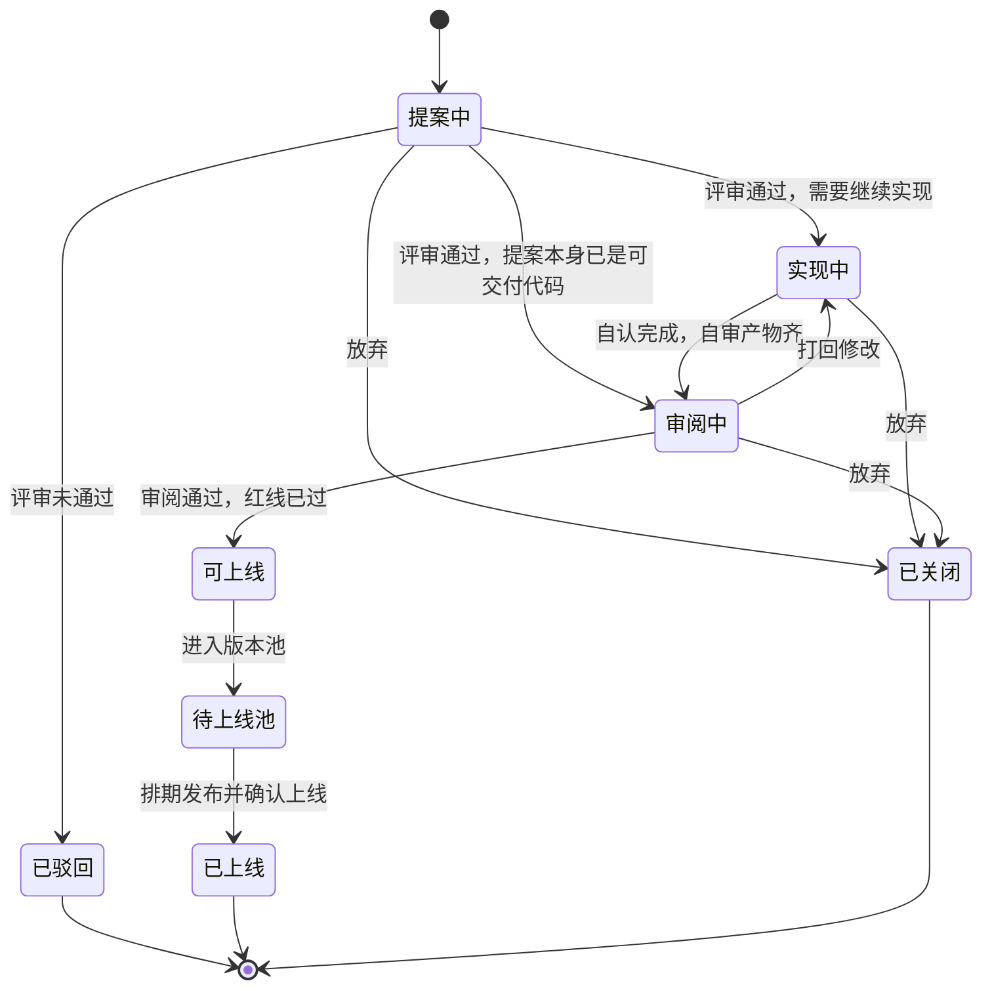

# Helix 需求说明

Helix 是研发项目的管理系统。人和 AI 围绕同一项研发任务协同。

流程模型整理自 qingflow-workspace 已经跑通的产研交付流程，收束到 Helix 的三个大阶段。数字员工的分工来自同仓库的 qingtask 与 pi-agent。本文只写流程和系统要记下的事实，不写各仓编码目录、skill 安装方式。

## 1. 要解决的事

AI 参与写代码之后，产出变快，可维护性更容易丢。Helix 用尽量少的流程成本，保住项目长期还能改、还能接手。

具体落到四件事：

1. 交接靠可运行、可观察的产物，讨论和结论记在 issue 上。
2. 每次交接留下可追溯记录：提案、方案、自审、审阅。
3. 架构判断、红线和规格沉淀成后续 AI 能读的长期依据。
4. 状态由人确认。AI 负责起草、取证和建议。

## 2. 唯一原则

Issue 是协同看板。

看板上的一条是任务条目。一个任务条目下面有一张或多张 issue，其中一张是主 issue，任务编号就是这张 issue 的编号。讨论、正文和结论记在 issue 上。允许变更范围、爆炸半径和契约以 Helix 的数据库为准，再同步到 issue 描述里的固定章节。任务状态以主 issue 为准：改状态先写主 issue，写成功后再改库；写失败或两边不一致时，库改成主 issue 上的状态。任务条目汇总这条交付：描述、负责人和时间。

由此确定：

- 看板按三个大阶段分列：提案、实现、上线。任务状态等于主 issue 的状态。
- 只有主 issue 时，没有边。
- 有子 issue 时，子 issue 组成有向无环图。主 issue 不进这张图。实现按拓扑分层推进，边上维护锚定契约。见 2.1。
- 代码变更挂在具体 issue 上，可以有多份（demo、文档、实现）。变更说明进展。任务的阶段和状态以主 issue 为准。

### 2.1 一个任务里的 issue 图

任务条目是排期和看板上的那一条。Issue 是里面真正协同的单元，各自走提案、实现、上线。拆分不再另开一批看板卡片。

子 issue 之间是有向无环图。边从前置指向后继：前置到达可上线之后，后继才可以进入实现。同一层里、前置都已满足的子 issue 可以并行。拓扑排序给出的是分层，同一层没有先后。图里有环时，任务留在提案，先把环拆掉。主 issue 不是图上的点。

每张 issue 单独维护允许变更范围和爆炸半径。这两项写在这张 issue 上，不写在任务条目上，也不从同一层的其他 issue 继承。

允许变更范围写这张 issue 可以改的模块、接口和数据，并写明不能碰的地方。实现只能待在这个范围里。越过范围要先改这张 issue 自己的范围，不能借相邻 issue 的范围动手。爆炸半径写这次改动出错时会波及的调用方、数据和下游 issue。审阅按这张 issue 自己的爆炸半径看影响面。

边上可以挂一份契约，用来写明后继可以依赖前置的什么。没有跨边界承诺的边只表示顺序，例如同一模块里的先后步骤。跨模块、接口、数据或协议的边必须有契约。

契约记在边上，有修订号，不写进评论。一份契约写两块：承诺的接口、字段、错误和行为；明确不承诺的事。状态只有三种：

| 状态 | 含义 |
| --- | --- |
| 草案 | 方案可以起草。后继还不能靠它开工 |
| 已锚定 | 人确认了这一修订。前置和后继都钉在这个修订号上 |
| 失锚 | 前置改了承诺并产生新修订，后继还没重新确认 |

锚定是人的动作。数字员工只能起草。已锚定之后，前置若要改这份承诺，必须新开修订。新修订一出现，这条边变为失锚。后继还没开始实现，就继续等。后继已经在实现或审阅，退回实现中，并在那张 issue 上写明契约变了。

后继进入实现中，要同时满足：

1. 每条入边的前置 issue 已经可上线、在待上线池或已上线。
2. 需要契约的入边都处于已锚定，且后继认的就是当前修订。

任务状态等于主 issue 的状态。子 issue 仍是协作内容，不单独决定任务状态。定时治理线程读主 issue 的固定章节，库里的状态和主 issue 不一致就改库。列表只返回库里已有的状态。没有登录身份时这一轮跳过。

### 2.2 数据放在哪

Helix 的数据库维护结构化数据。Git issue 是协作黑板。描述里除固定章节以外的正文，以及全部评论，都属于 issue。

每张 issue 的描述里有一段固定章节，用 `<!-- helix -->` 和 `<!-- /helix -->` 包住。Helix 只覆盖这一段。章节外面的文字和评论，同步时不动。章节还不存在时，Helix 把它补在描述末尾，不改写已有正文。

章节里写着：状态、阶段、负责人、允许变更范围、爆炸半径、结论、版本、关联的合并请求、测试环境地址。状态以主 issue 这一段为准，不用标签存状态。改任务状态时先改主 issue 的这一段，写成功再改库。主 issue 没有接受这次修改，或之后两边不一致，就把库改成主 issue 上的状态。其余字段仍先改库，再同步这一段。有子 issue 时，主 issue 的章节再写任务汇总，子 issue 的章节不写这份汇总。

契约的正文和修订放在该项目 workspace 的规格文件里。workspace 是这个项目指定的那一个 GitLab 工程。边上只记一条指向该文件的路径，不把正文抄进表，也不把正文写进这一段。正文留在章节外面。打开一张 issue 时，按编号向 GitLab 现读正文和评论，不写入库。运行记录这阶段不建表。

核心表见 [docs/schema.md](schema.md)。

## 3. 三个阶段

任务的大生命周期按顺序经过提案、实现、上线。迭代关心质量和完成度，上线关心进哪个版本、何时发布。两条线在「可上线」交接。

| 大阶段 | 阶段内状态 | 这个阶段要完成的事 |
| --- | --- | --- |
| 提案 | 提案中、已驳回 | 复核需求；产出文档、demo 等材料；决定是否进入实现 |
| 实现 | 实现中、审阅中 | 把提案明确的需求做成工程实现，并用审阅和红线保障稳定性 |
| 上线 | 可上线、待上线池、已上线 | 版本排期，确认上线 |
| 任意阶段可进入 | 已关闭 | 主动放弃，并写明原因 |

已驳回、已上线、已关闭是终态，默认不占当前看板。

## 4. 提案阶段

这一阶段把要做的事情核对清楚，并留下下游能直接看懂的材料。

### 4.1 入口与出口

入口可以是想法、文档、草图、bug 描述或代码。材料本身要闭环：做什么、边界在哪、预期结果是什么。

出口按提案性质区分。判据是：工程上可以糙、可以 mock、可以先不接真实接口，但 feature 必须能跑、逻辑要完整。

| 性质 | 怎么判定 | 离开提案的条件 |
| --- | --- | --- |
| BUG | 已有正确行为被破坏 | 指定承接人后直接进入实现。修复本身就是实现 |
| 技术变更 | 重构、依赖升级、性能、基础设施等，不由业务功能驱动 | 方案对齐到可以动手，方案可以是文档或代码 |
| 小型 feature | 小范围功能增改，不改产品或架构结构 | 可运行 demo 经过相关人审阅 |
| 大型 feature / 架构变更 | 新增完整功能、架构重构、核心产品逻辑重构 | demo 审阅通过后，在同一个任务条目里拆成 issue 图，并起草边上的契约。任务仍是看板上的一条 |

feature 的 demo 要能直接说清功能交互、交互边界和功能本质，承接人不用再猜需求。

### 4.2 评审要定的三件事

提案中的 issue 由管理者评审，一次定完：

1. 是否采纳。
2. 谁承接。
3. 下一步进入实现中，还是因提案本身已是可交付代码而直接进入审阅中，或驳回。

默认按变更偏向分配承接人：偏前端给前端，偏后端给后端，纯 UI 给设计。能力可以跨界，默认分配仍按专长。

## 5. 实现阶段

这一阶段负责两件事：把提案里已经明确的需求做成工程实现，并保障结果稳定、可接手。

### 5.1 实现中

承接人落地已经解锁的 issue。后继 issue 要等前置可上线，且需要契约的入边已经锚定，见 2.1。改代码时以这张 issue 的允许变更范围为界。变更规模由承接人判断：

- 小型变更：按提案材料直接实现。
- 大型变更：先写分层方案和可执行规格，再按规格实现。规格同时作为这次实现的依据，以及以后 AI 理解这块业务的记录。

实现完成、准备进入审阅时，issue 上要齐这些产物：

| 产物 | 要求 |
| --- | --- |
| 代码 | 可运行，逻辑完整 |
| 配置变更 | 列出涉及的配置 |
| 数据变更 | 给出迁移或脚本 |
| 外部依赖 | 写明新增或升级的依赖 |
| 说明文档 | 把这次改动讲清楚 |
| 红线自审 | 实现人先对照红线自检 |
| 规格 | 大型 feature 必须有；其他可选 |

交接物要能运行、能查看。审阅人不用靠口头补上下文。

### 5.2 审阅中

审阅是稳定性保障，参与范围跟提案影响面一起变，默认异步。只有影响整个团队的大型 feature 或架构变更才全体对齐。

| 提案性质 | 谁参与审阅 |
| --- | --- |
| BUG | 提案阶段不审，直接进实现；实现完成后按工程关注点审 |
| 技术变更 | 管理者和指定研发 |
| 小型 feature | 产品加相关职能，通常两到三人 |
| 大型 feature / 架构变更 | 全体 |

各职能在 issue 上留下自己的审阅结论：

| 职能 | 看什么 |
| --- | --- |
| 工程 | 代码能否被另一个研发解释清楚；异常处理是否完整；红线 |
| 产品 | 功能是否完整，是否符合提案里的交互和边界 |
| 设计 | 视觉和交互是否符合规范 |
| 测试 | 是否稳定、是否可测、回归是否覆盖关键路径 |
| 管理者 | 架构方向，以及红线的最终判断 |

AI 生成的代码有两条硬要求：

1. 另一个研发职能必须能解释这段代码：逻辑是什么、为什么这样写、以后谁能改。解释不了就不通过。
2. AI 生成的逻辑要有异常处理，不能是没有失败路径的裸逻辑。

流转规则：

- 任一参与方打回，issue 回到实现中，并写明要改什么。
- 相关审阅都通过，且红线已过，进入可上线。
- 审阅和实现可以来回。超过两轮仍定不下来，交给管理者三选一：放行、退回提案重新定义、关闭。

## 6. 上线阶段

这一阶段做版本排期和上线确认。迭代流程在可上线结束，后面只处理发布时机和版本组合。

- 可上线是交接状态。审阅通过并且红线已过，就进入待上线池。
- 待上线池按版本编排。编排节奏、灰度和回滚方式按项目自己的发布规则，Helix 记录「进哪个版本、是否确认上线」。
- 涉及红线的发布要有回滚预案。
- 上线确认后，issue 变为已上线。
- 这次变更如果产生了规格，审阅通过后把规格归档。归档后的规格是这块业务的当前记录。

## 7. 人机协同

协同发生在 issue 上。数字员工的编制、运行和人工确认见第 11 节。

- AI 可以读 issue、整理差异、起草提案、方案、自审和审阅意见，并给出下一步状态和理由。
- 改变阶段、状态，以及关闭 issue，由人确认后才生效。
- 系统保存建议、确认人和确认结果，方便以后追溯是谁定的。

## 8. 角色

不单设流程角色。同一个人可以发起提案，也可以承接实现。各职能有自己默认负责把关的内容。

| 角色 | 主要承担 |
| --- | --- |
| 产品 | 发起需求，提供可运行 demo，审业务逻辑和交互边界 |
| 设计 | 发起设计改动，审视觉、交互反馈和规范；关键页面的体验判断在设计 |
| 工程 | 发起技术提案，承接实现，审工程质量、稳定性和红线 |
| 测试 | 发起质量类提案，维护关键路径回归，审可测性和覆盖 |
| 管理者 | 统筹计划，评审提案，分配承接人，做红线最终判断；悬而未决、会挡住其他人的问题先由管理者承担 |

产品交付 demo 时，业务路径要完整：主流程、分支、异常、空状态和加载状态都要能看到。

## 9. 红线

红线是稳定性的硬约束。任一红线未过，issue 不能进入可上线。其余质量问题靠后续迭代，不单独加审批环节。

| 红线 | 什么时候卡 |
| --- | --- |
| 后端变更保持向下兼容 | 接口、数据或契约变更 |
| 商业化变更由产研负责人确认 | 计费、定价、套餐、合同 |
| 破坏性数据操作单独强审 | 丢表、清空、无条件更新或删除、大批量删除 |
| 敏感信息不能写进代码 | 密码、密钥、token |
| 接口要有鉴权和越权校验 | 后端 API |
| 管理员和普通用户的身份要隔离 | 涉及权限分级 |
| 外部共享资源的变更不能长时间持锁 | 数据库等共享资源上的结构或数据变更 |

## 10. 系统要记下的内容

结构化字段落在 Helix 的库里，见 [docs/schema.md](schema.md)。下面是这些字段在业务上要覆盖的内容。

每个任务条目至少有：描述、编号、负责人、开始时间、预计结束时间、实际结束时间，以及按 2.1 汇总出的状态。

每张 issue 至少有：

- 标题、说明、提案性质
- 当前大阶段和阶段内状态
- 发起人、承接人
- 允许变更范围、爆炸半径。多张 issue 时各自一份，任务条目不共用
- 关联的合并请求：编号、标题、状态、地址。每张 issue 各自一份，不从别的 issue 推断
- 测试环境的名称和访问地址。每张 issue 各自一份
- 关联的文档、demo 和代码变更
- 审阅结论、红线结果
- 所属版本，以及是否已确认上线
- 对人展示的结论：做了什么、卡在哪、需要谁确认什么

子 issue 的归属，以及子 issue 之间谁依赖谁，写在 workspace 根目录的 `board.yaml`。需要契约时，边上记仓库里那份规格的路径。正文和修订留在那个文件里。

看板默认展示三个大阶段里的活跃任务条目。可以按状态、性质、承接人和版本筛选。点开一条任务，先看主 issue，再看子 issue。

数字员工的运行记录下一阶段再落表。这阶段不写进库，也不用标签充当数据库。

## 11. 数字员工

qingtask 已经把四类数字员工跑通：提案起草、方案、实现、独立审阅。Helix 保留这套分工和人机闸门，并改掉它的三处结构性问题。

| qingtask 的做法 | Helix 的要求 |
| --- | --- |
| 运行状态、角色、实现阶段、监督信息都堆在 issue 标签和评论里 | issue 继续做协同看板。一次执行是独立的运行记录，挂在 issue 上 |
| 用 GitLab pipeline 当 worker，定时扫标签再派 job | Helix 自己调度 worker。人确认或系统续跑时直接派发，不经过流水线 |
| 数字员工挤在一串标签卡片里，和任务看板混在同一套列表 | 任务看板和数字员工工作台分成两个界面。工作台按角色和运行状态看任务，任务详情里看这次执行和待人确认的问题 |

### 11.1 编制

四个角色各自独立运行，不共享对方的思考过程。同一张 issue 上同一时刻只有一个角色在执行。同一个任务里，同一层上已经解锁的 issue 可以各有一个角色在跑。人明确换成另一个角色时，先取消当前这张 issue 上的运行，再派新的。

| 角色 | 做什么 | 不做什么 |
| --- | --- | --- |
| 提案起草 | 读粗糙描述和结构化上下文，写成完整提案，并把初版文档或 demo 落到分支和变更上 | 不改任务阶段，不合并变更 |
| 方案 | 调研现状，列出要定的设计点，在这个任务里补齐 issue 图和边上的契约草案。同一层的 issue 可以并行，然后把已解锁的 issue 交给实现 | 不写实现代码，不自己锚定契约。只有不可逆的架构分叉、关键信息缺口、或碰到必须人定的边界时才停下 |
| 实现 | 按已确认方案、这张 issue 的允许变更范围，以及入边上的当前锚定修订写代码。内部经过方案中、编码中、交给自动审、人工审。做完代码后交给独立审阅 | 不审自己写的代码，不改任务大阶段，不越过这张 issue 的允许变更范围。入边失锚时停下来等人，不沿用旧修订继续改 |
| 审阅 | 只读变更差异和规格，按一致性、这张 issue 的爆炸半径、红线、明显缺陷给结论：通过并交给人工、打回实现去改、或因材料不足而阻断 | 不读实现者为自己辩解的评论。判不了的业务红线标成待人工确认 |

实现者内部阶段按这个顺序推进：方案中 → 编码中 → 自动审中 → 人工审中。自动审中是交棒点，审阅者接手；打回则回到编码中。人工审通过后，任务大阶段仍由人确认，再进入上线。

### 11.2 一次运行

人在某张 issue 上选择角色并启动，或系统在可以续跑时再次派发。worker 拿到的是这一次运行：哪个任务、哪张 issue、哪个角色、从哪个内部阶段继续，这张 issue 的允许变更范围和爆炸半径，以及每条入边当前锚定的修订。接口以这份修订为准，不从评论里推断。

运行状态：

| 状态 | 含义 |
| --- | --- |
| 排队 | 已决定要跑，worker 尚未开始 |
| 执行中 | worker 正在做 |
| 待判定 | 这一轮做完，等系统或人决定下一步 |
| 等人 | 停下来要人确认或补充。人回复后，同一角色继续跑 |
| 卡住 | 缺信息、缺权限或超出能力，必须和等人一起出现 |
| 失败 | 自验证没过，或重试耗尽。这不是回一句话就能续的，要人先看失败报告 |

能自己往下做的，收尾后回到排队，由调度再拉起。需要人的，进入等人，不再空转。失败要留下试过什么、卡在哪、还缺什么。

worker 的工作目录可以随运行结束丢弃。留下的东西只有三处：任务分支上的提交、写给人和后续运行看的结论、Helix 里的这条运行记录。

### 11.3 边界

数字员工被派发后按这个顺序做：理解任务，预检信息和权限，执行，自验证，收尾。预检不通过就进入等人并说明缺什么，不靠猜测往下做。

可以自己做：

- 把代码提交到这次任务的分支
- 在有意义的节点写下进展
- 推进自己的运行状态和实现内部阶段
- 在实现完成时把任务交给审阅角色

必须停下来等人：

- 修改任务大阶段、关闭 issue，或锚定、改写契约修订
- 改动超出这张 issue 的允许变更范围
- 合并变更，或推送到受保护分支
- 把密钥、token 写进评论、提交或日志
- 改这次任务以外的分支或仓库

商业化、鉴权和身份隔离这类红线，审阅者只标「需人工确认」，不下最终结论。

### 11.4 等人时怎么交互

进入等人时，要写清三件事：做到哪了、需要谁决定什么、有哪些选项。有备选方案时，每个选项写清代价、影响面和推荐项。

人在该 issue 上回复。回复写进运行记录，并重新派发同一个角色。数字员工下次起来先读这条回复再继续。

常见停点：

- 方案有分叉，或单一方案需要人认可
- 自动审已经通过，等负责人做人工审
- 缺信息、权限或数据
- 超出当前角色的能力

失败和等人分开。失败进入失败列表，由人查看报告后再决定是否重新派发。

### 11.5 执行过程

每次运行把过程推回 Helix，任务详情里可以看着它做。内容包括会话、工具调用、标准输出和状态变化。

- 连接从 worker 连向 Helix。worker 断线后可以带着未确认的序号续传。
- 单条输出过长要截断，避免工具结果撑满记录。
- 过程是尽力展示。推送失败不中断正在做的工作。
- 运行结束后保留一段时间，方便回看。

### 11.6 工作台要呈现的内容

任务看板回答「这件事走到哪个阶段」。数字员工工作台回答「谁在跑、跑到哪、谁停下来了」。

工作台按四个角色列出当前运行，实现者再按方案中、编码中、自动审中、人工审中分组。每个角色能看到排队、执行中、等人和失败的数量。失败单独列出来，不混进某个角色的正常队列。

打开一个任务，先看到主 issue。还有子 issue 时，能看到实现顺序、每一层能不能开工、每条边上的契约状态。点进一张 issue，能看到这张 issue 自己的允许变更范围和爆炸半径，以及正文、评论、当前运行、最近结论和执行过程。只有处于等人时才出现回复入口。回复之后能看到新的一次运行已经派出去。
